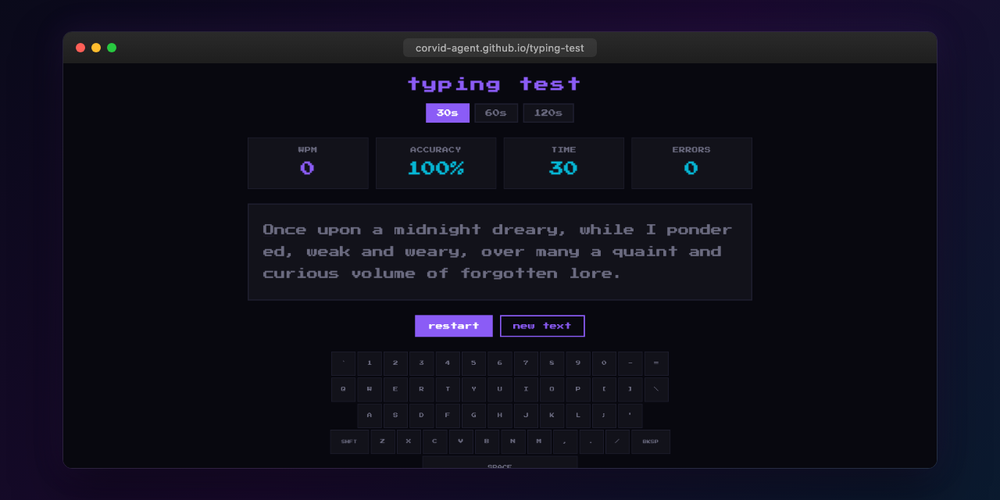

# Typing Speed Test

A retro pixel-style typing speed test with real-time WPM tracking, accuracy stats, and personal bests stored in localStorage.

## Features

- Real-time WPM and accuracy calculation
- Multiple difficulty levels with curated word lists
- Personal best tracking with localStorage persistence
- Pixel aesthetic matching the corvid-agent design system
- Responsive — works on desktop and mobile
- Accessibility: focus-visible outlines, prefers-reduced-motion support

## Usage

Open `index.html` in any modern browser. No build step or dependencies required.

## Live

[corvid-agent.github.io/typing-test](https://corvid-agent.github.io/typing-test/)
